# HiC-TAD-Library

A Python library for visualizing and analyzing Hi-C data, focusing on Topologically Associating Domains (TADs), compartments, and insulation scores.

## Installation

You can install the required dependencies using the provided `Makefile`:

```bash
make install
```

Required packages include: `cooler`, `cooltools`, `bioframe`, `matplotlib`, `pandas`, `numpy`, and `alphagenome`.

### AlphaGenome Integration
This project now integrates [AlphaGenome](https://www.alphagenomedocs.com/) for high-resolution genomic predictions and visualizations.

To set up AlphaGenome:
1. Ensure your API key is in the `.env` file as `ALPHA_GENOME_API_KEY`.
2. Run `make install-alphagenome`.

## Usage

Generated visualizations are saved in the `media/` directory.

### Quick Start
To install dependencies and run all visualizations:
```bash
make setup
```

### Individual Commands
- **Run Visualizations**: `make run`
- **Clean Output**: `make clean`

## Visualizations

This library generates various Hi-C visualizations that reveal different aspects of 3D chromatin organization. Below are examples from two genomic regions: **Sox11 (Chr12)** and **Mir9-2 (Chr13)**, demonstrating the full suite of analysis capabilities.

### 1. High-Resolution Contact Heatmaps
Standard square heatmaps display Hi-C contact frequencies, where darker/warmer colors indicate higher interaction frequencies. The diagonal represents self-ligation events, while off-diagonal patterns reveal TAD structures as triangular blocks of enriched interactions.

#### Sox11 Region (chr12:26-28 Mb)

*The Sox11 locus shows clear TAD structures visible as block-like enrichments along the diagonal. These self-interacting domains are fundamental units of chromatin organization.*

#### Mir9-2 Region (chr13:83.5-84.5 Mb)
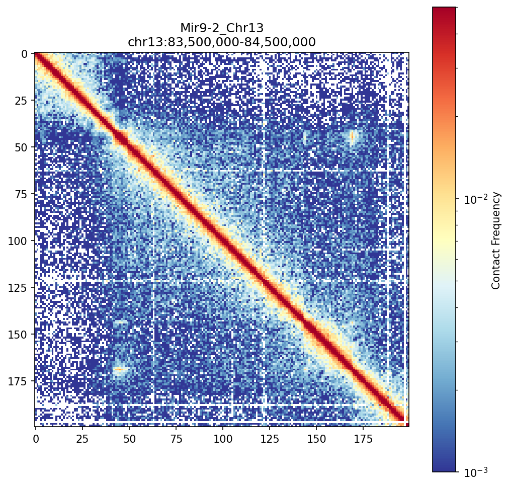
*The Mir9-2 region demonstrates well-defined TAD boundaries (visible as transitions between enriched blocks) that compartmentalize the genome into functional units.*

### 2. Triangular Heatmaps
Rotated 45-degree views are the standard in Hi-C visualization. This transformation makes TAD boundaries appear as vertical valleys and highlights the hierarchical organization of chromatin domains.

#### Sox11 Region

*Triangular view of Sox11 clearly reveals TAD boundaries as vertical dips and the nested hierarchical structure of chromatin domains within larger compartments.*

#### Mir9-2 Region

*This rotated view makes it easier to see the insulation at TAD boundaries and the continuous interaction landscape across the region.*

### 3. Insulation Scores & Boundaries
Insulation score analysis uses sliding windows to quantify local interaction frequencies. Minima in the insulation track (valleys) correspond to TAD boundaries where interactions are depleted. Multiple window sizes (25kb, 50kb, 100kb) reveal boundaries at different scales.

#### Sox11 Region
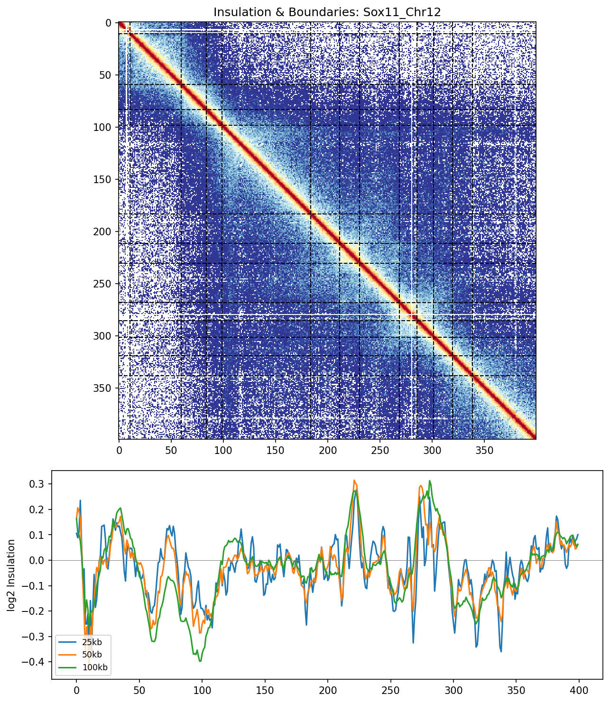
*Top: Hi-C heatmap with detected boundaries marked as dashed lines. Bottom: Insulation scores at three window sizes. Boundaries appear where all three curves dip simultaneously, indicating robust structural transitions.*

#### Mir9-2 Region
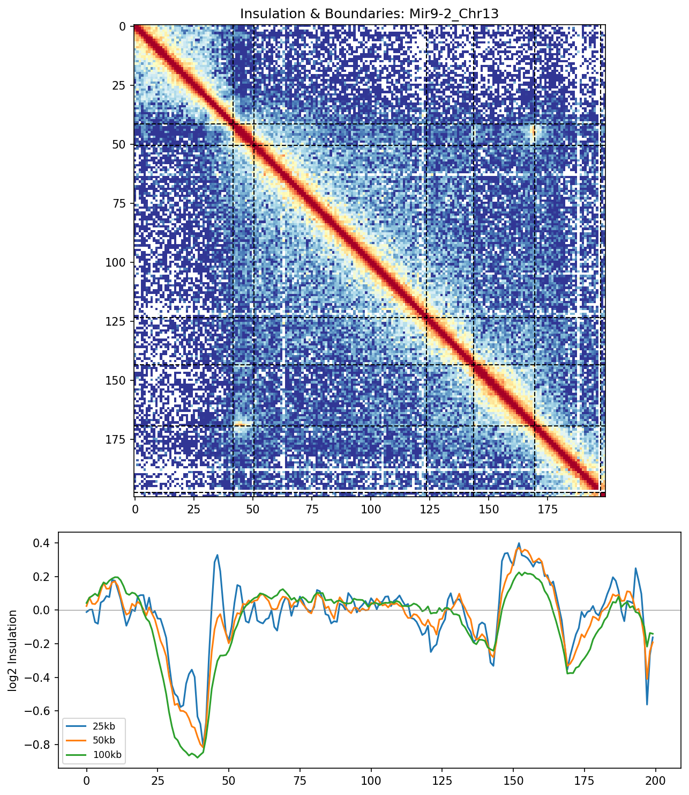
*The insulation track reveals multiple boundary positions where chromatin interactions are depleted. Concordance across window sizes indicates strong, consistent boundaries.*

### 4. Directionality Index
The Directionality Index (DI) measures the bias in interaction directionality, helping identify TAD boundaries. Positive values (red) indicate downstream bias, negative values (blue) indicate upstream bias, and transitions through zero mark boundaries.

#### Sox11 Region
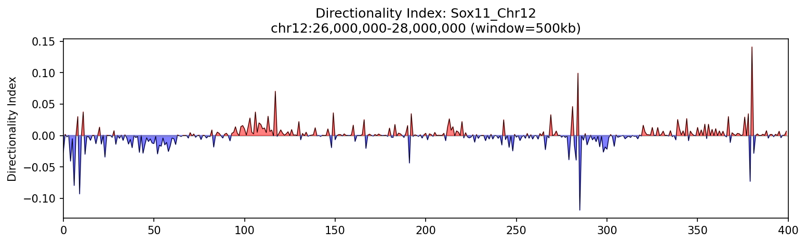
*Directional bias changes reveal TAD organization. Red regions show loci preferentially interacting downstream, blue regions upstream. Transitions mark domain boundaries.*

#### Mir9-2 Region
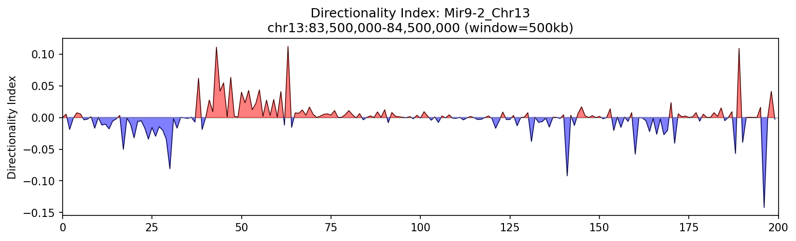
*Clear directional changes across the Mir9-2 region highlight TAD boundaries and the bipartite nature of chromatin domains.*

### 5. Boundary Strength Analysis
Not all boundaries are equal. This analysis ranks boundaries by their prominence (depth of insulation minima), classifying them as strong (red), weak (orange), or sub-threshold (gray). Stronger boundaries typically mark more stable, functionally important domain transitions.

#### Sox11 Region
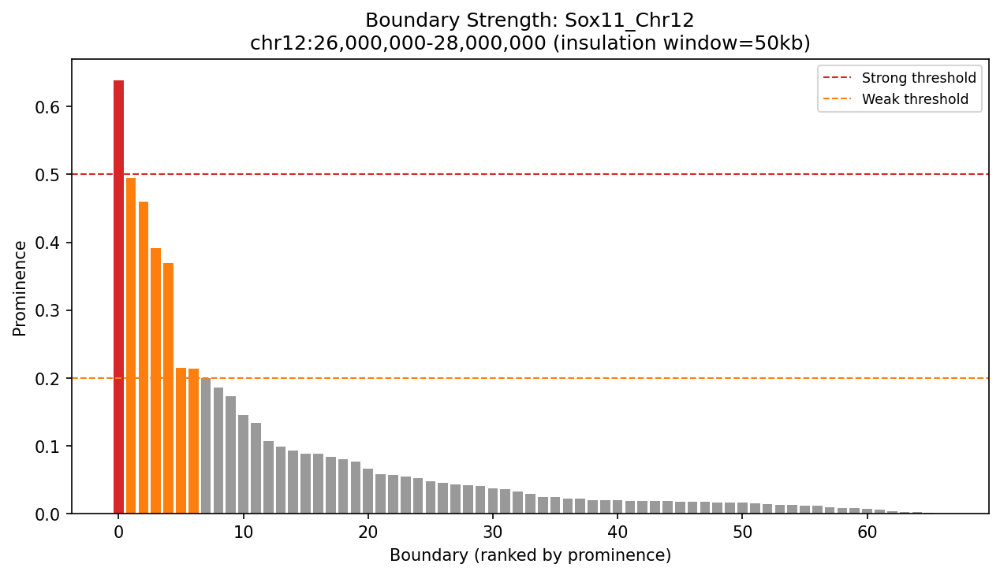
*Ranked boundary prominence for Sox11. The tallest bars represent the strongest boundaries with the deepest insulation valleys. Strong boundaries (above red line) are most conserved across cell types.*

#### Mir9-2 Region
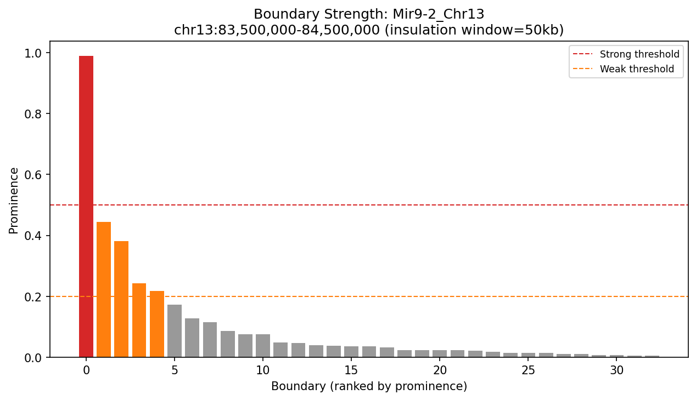
*Distribution of boundary strengths at Mir9-2. Variation in prominence suggests a hierarchy of domain organization, with major boundaries separating large regions and minor boundaries creating sub-domains.*

### 6. Multi-Scale Insulation Analysis
Multi-scale analysis reveals how boundaries appear across different window sizes (5kb to 500kb). Persistent boundaries that span multiple scales are typically the most functionally significant, while scale-specific features may represent transient or cell-type-specific organization.

#### Sox11 Region

*Heatmap showing insulation scores across genomic positions (x-axis) and window sizes (y-axis). Vertical blue streaks indicate boundaries persistent across scales. Red regions show locally high interaction.*

#### Mir9-2 Region
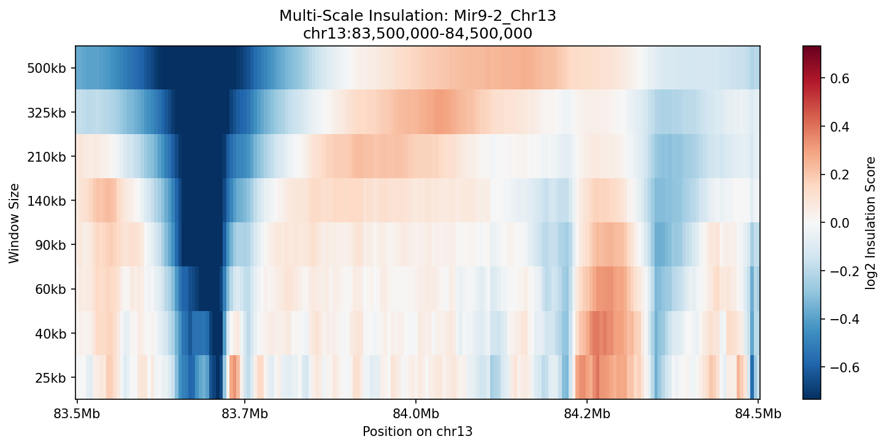
*Scale-dependent boundary detection. Strong boundaries appear as vertical features spanning multiple window sizes, while weak or cell-type-specific boundaries may only be visible at specific scales.*

### 7. TAD Overlay on Contact Maps
TADs are called from boundary positions and overlaid on contact maps as L-shaped brackets marking the start and end of each domain. The bottom track shows the insulation score with detected boundaries highlighted.

#### Sox11 Region

*Top: Contact map with TAD boundaries drawn as L-shaped corners. Each TAD is a self-interacting chromatin domain. Bottom: Insulation score track with strong (red) and weak (orange) boundaries marked.*

#### Mir9-2 Region
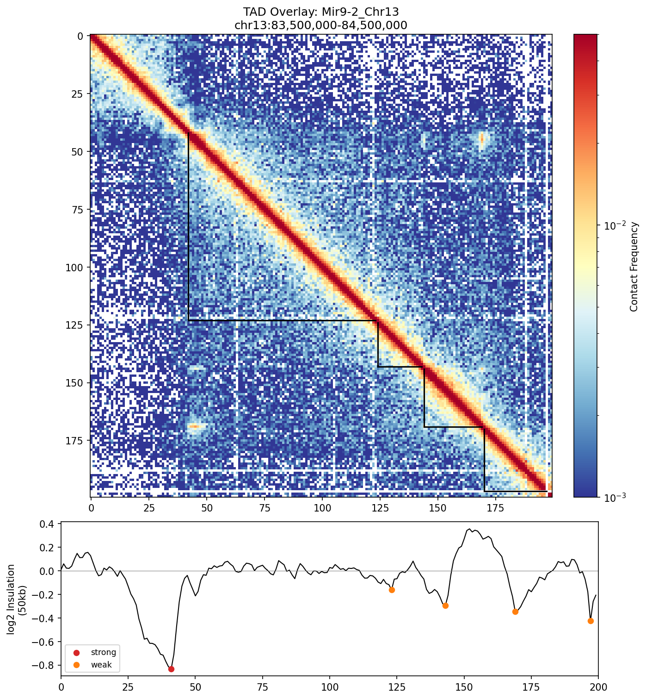
*TAD calling results overlaid on the contact map. The L-shaped brackets delineate individual TADs, showing how the genome is partitioned into discrete interaction domains.*

### 8. Boundary Pileup Analysis
This meta-analysis aggregates all boundaries genome-wide to create an average "typical boundary" contact pattern. The characteristic corner peak shows that TAD boundaries prevent interactions across the boundary while allowing interactions within each domain.

#### Sox11 Region
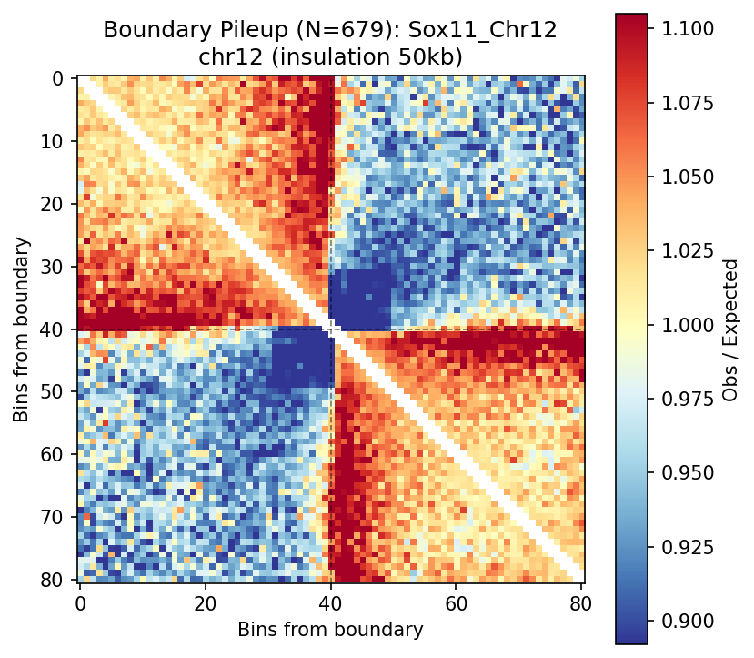
*Average contact pattern around boundaries (N boundaries aligned at center). The characteristic square pattern with corner enrichment shows blocked interactions across boundaries and enriched within-TAD contacts.*

#### Mir9-2 Region
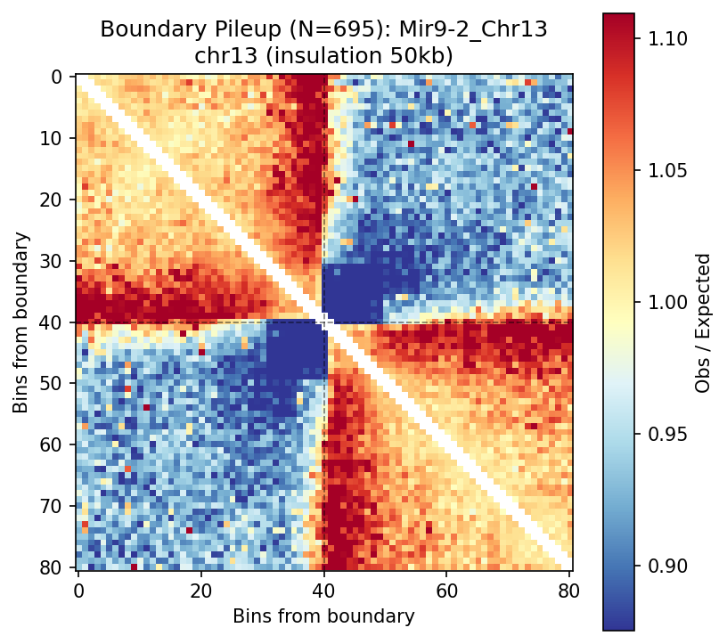
*Pileup analysis reveals the stereotypical boundary signature: interactions are depleted at the boundary center (crosshairs) and form characteristic corner peaks flanking the boundary.*

### 9. Combined Multi-Panel Boundary Analysis
Comprehensive view integrating heatmap, TAD calls, insulation score, directionality index, and boundary positions in a single figure for complete chromatin architecture assessment.

#### Sox11 Region

*Integrated view: (1) Contact map with TAD brackets, (2) Insulation score with boundary classification, (3) Directionality index showing interaction bias, (4) Boundary tick marks showing positions and strengths. This comprehensive view enables correlation of multiple boundary detection methods.*

#### Mir9-2 Region
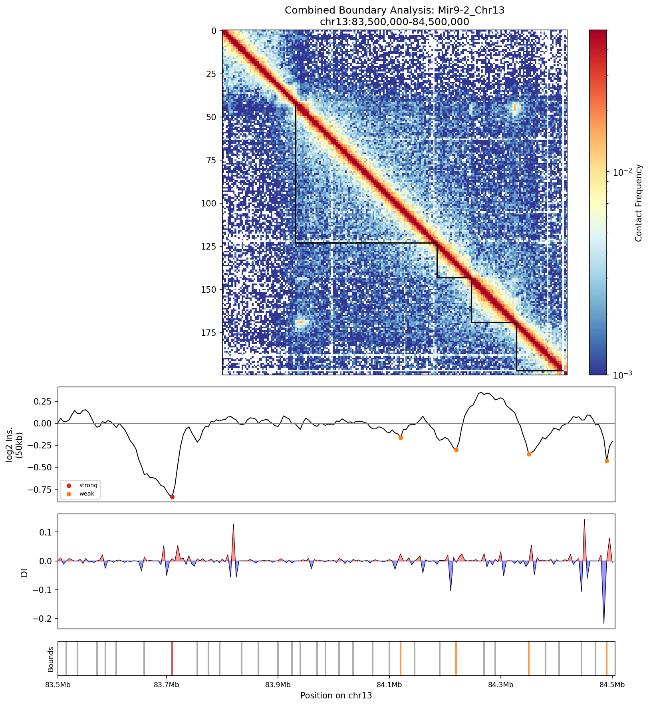
*Complete boundary analysis panel. All tracks are aligned to facilitate comparison between detection methods. Strong boundaries show concordant signals across all metrics.*

### 10. A/B Compartments (E1 Eigenvector Track)
Large-scale genomic compartmentalization (A/B compartments) revealed by principal component analysis. A compartments (positive E1, red) are transcriptionally active and gene-rich; B compartments (negative E1, blue) are inactive and gene-poor. The triangular heatmap below shows characteristic checkerboard patterns of A-A and B-B interactions.

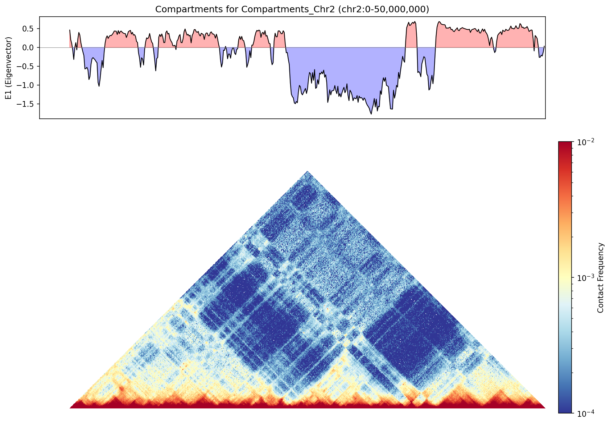
*Top: E1 eigenvector track showing compartment assignments across Chr2. Bottom: Triangular contact map showing checkerboard pattern where A compartments (red) interact preferentially with other A compartments, and B (blue) with B.*

### 11. Saddle Plots
Saddle plots quantify compartment strength by binning genomic regions by E1 value and plotting interaction enrichment. Strong compartmentalization produces a saddle shape with high A-A (top-right) and B-B (bottom-left) interactions and depleted A-B interactions.

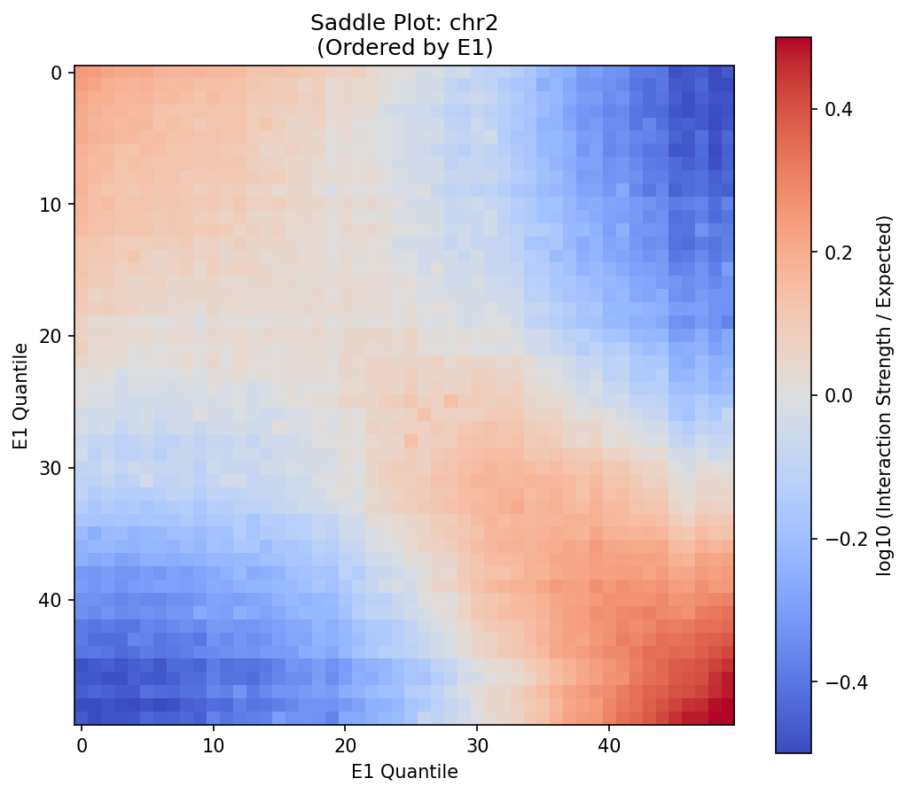
*Interaction strength vs. E1 quantile. The saddle shape (corners elevated, center depressed) indicates strong compartmentalization. Top-right: A-A interactions (enriched). Bottom-left: B-B interactions (enriched). Center: A-B interactions (depleted).*

### 12. TAL1 Variant Analysis (AlphaGenome)
Using AlphaGenome AI models to predict the functional impact of oncogenic variants near the TAL1 locus, a master regulator in T-cell leukemia.

#### Variant Positions
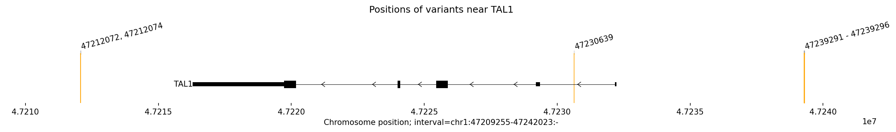
*Genomic positions of oncogenic T-ALL variants that dysregulate TAL1 expression. The variants cluster in three regions: a new 3' enhancer (47212072-74), an intergenic region (47230639), and the MUTE site (47239291-296). The TAL1 gene is shown with its exon structure.*

#### Jurkat Variant Effect Prediction
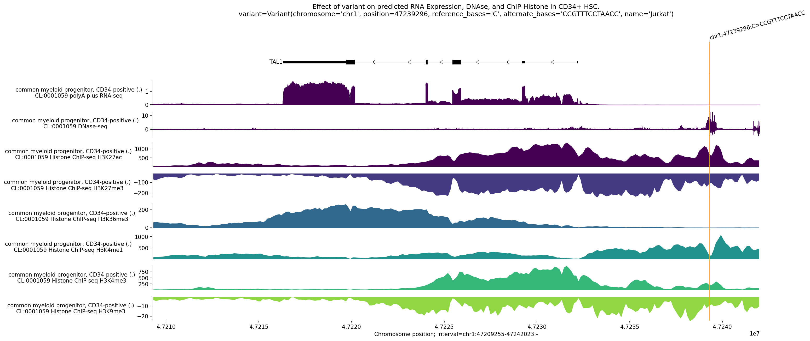
*AlphaGenome prediction of the Jurkat variant (13bp insertion at chr1:47239296) on gene expression, chromatin accessibility, and histone modifications in CD34+ hematopoietic stem cells. Positive values (red) indicate increased signal; negative (blue) indicates decreased signal. The variant dramatically increases TAL1 RNA expression by creating a new enhancer element, explaining its oncogenic potential.*

### 13. AlphaGenome Predictions (Additional)
Advanced modalities including predicted contact maps, CTCF binding, and Virtual 4C tracks.

#### Predicted TADs and CTCF


#### Virtual 4C


### 14. DNA Deletion Effect Analysis (AlphaGenome)
**In silico perturbation experiments** using AlphaGenome AI to predict how structural variants (deletions) affect 3D genome organization. These analyses simulate the consequences of removing genomic regions—such as TAD boundaries, CTCF binding sites, or regulatory elements—and visualize the resulting changes in chromatin contact patterns.

#### Understanding the Visualizations

Each deletion analysis figure contains three components:
1. **Gene Track (Top)**: Shows all protein-coding genes in the region with gene names labeled. The red shaded area marks the deleted region.
2. **Wild-Type Contact Map (Left)**: AlphaGenome's predicted chromatin contact frequencies for the reference genome, showing TAD structures as diagonal blocks of high interaction (dark red).
3. **After Deletion Contact Map (Right)**: Predicted contact frequencies after removing the specified genomic region, revealing how the deletion disrupts chromatin architecture.

**Reading Contact Maps**:
- **Diagonal blocks (red)** = TADs (self-interacting chromatin domains)
- **Off-diagonal blocks** = Long-range chromatin loops
- **Blue dashed lines** = Boundaries of the deleted region
- **Color intensity** = Contact probability (darker = stronger interactions)

---

#### OCT4 TAD Boundary Deletion (chr6:30,630,000-31,630,000)
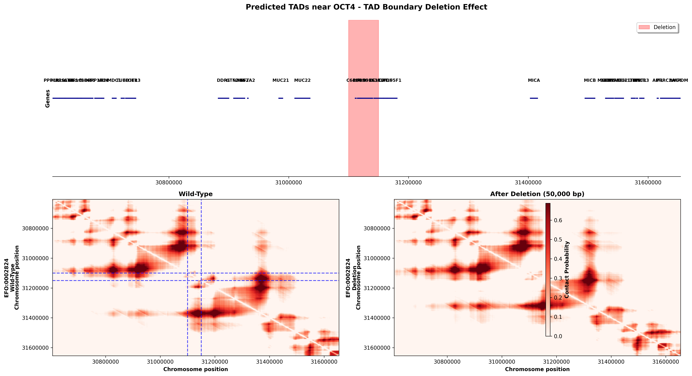

**Deletion**: 50kb removal at position 31,100,000-31,150,000 (potential TAD boundary region)

**What This Shows**:
- The OCT4 locus contains multiple genes involved in pluripotency and development
- The **wild-type** (left) shows complex TAD organization with strong diagonal contact blocks
- **After deletion** (right), the contact pattern is disrupted around the deletion site
- This demonstrates how **TAD boundary deletions** can alter compartment structure and potentially affect gene regulation
- The deletion removes a structural element that normally insulates chromatin domains, leading to aberrant inter-domain contacts

**Biological Significance**: Deletions at TAD boundaries can cause "enhancer hijacking" where regulatory elements gain access to genes they normally don't control, potentially causing developmental disorders or cancer. The OCT4 region is critical for embryonic stem cell identity, so architectural disruptions here could affect cell fate decisions.

---

#### NANOG Enhancer Deletion (chr12:7,280,000-8,280,000)
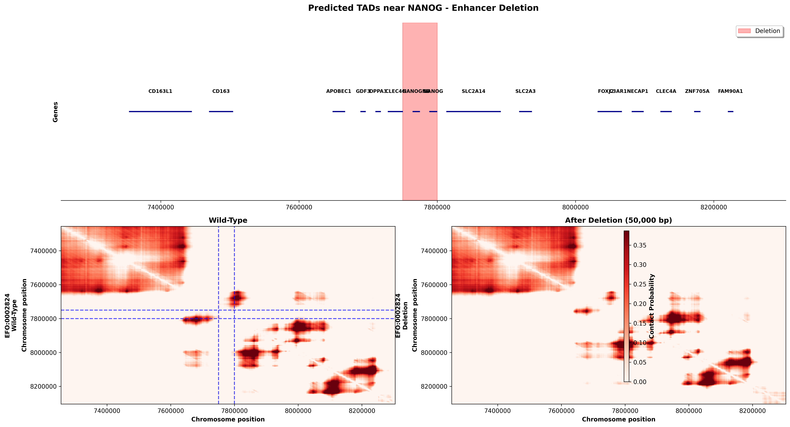

**Deletion**: 50kb removal at position 7,750,000-7,800,000 (regulatory element region)

**What This Shows**:
- The NANOG region contains multiple genes including NANOG (pluripotency regulator) and KRAS (oncogene)
- **Wild-type** shows well-defined TAD structures with strong contact domains
- **After deletion**, the chromatin architecture is extensively remodeled
- The deletion removes a genomic segment that may contain enhancers or CTCF sites that organize local chromatin structure
- Notice how contact patterns both upstream and downstream of the deletion are altered, showing long-range effects

**Biological Significance**: This type of deletion could:
1. **Remove enhancers** that activate NANOG or nearby genes, potentially disrupting pluripotency networks
2. **Disrupt CTCF loop anchors**, allowing inappropriate gene-enhancer contacts
3. **Alter TAD boundaries**, changing the regulatory landscape across hundreds of kilobases

Such structural variants are found in developmental disorders and cancers where precise gene regulation is critical.

---

#### SOX2 Regulatory Element Deletion (chr3:181,210,000-182,210,000)
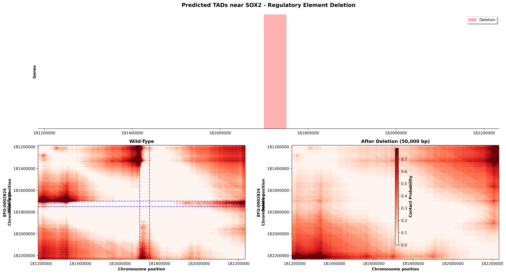

**Deletion**: 50kb removal at position 181,700,000-181,750,000 (regulatory region)

**What This Shows**:
- The SOX2 locus is a master regulator of neural development and stem cell maintenance
- **Wild-type** displays characteristic TAD organization with strong self-interactions (diagonal red blocks)
- **After deletion**, contact maps show altered interaction patterns, particularly affecting the middle of the region
- The symmetric nature of contact map changes reflects the biophysical constraints of chromatin looping
- Blue dashed lines mark where the deletion occurred, showing immediate and distal effects on chromatin folding

**Biological Significance**: SOX2 is essential for:
- **Neural stem cell maintenance**
- **Embryonic development**
- **Cellular reprogramming** (iPS cell generation)

Deletions in this region could:
- Disrupt long-range enhancer-promoter contacts essential for SOX2 expression
- Alter TAD insulation, causing misregulation of nearby genes
- Lead to neurodevelopmental disorders when occurring in human patients

**Key Insight**: Even deletions that don't directly affect coding sequences can have profound effects by reorganizing 3D chromatin architecture and disrupting regulatory element positioning.

---

### Technical Details: How Deletion Analysis Works

1. **AlphaGenome Prediction**: Google DeepMind's AlphaGenome AI model predicts chromatin contact frequencies from DNA sequence alone, trained on thousands of Hi-C experiments.

2. **In Silico Deletion**: We create two predictions:
   - **Reference**: Wild-type genomic sequence → Contact map
   - **Variant**: Sequence with deletion → Contact map showing architectural changes

3. **Side-by-Side Comparison**: Visual comparison reveals how structural variants affect:
   - TAD boundaries and insulation
   - Long-range chromatin loops
   - Compartmentalization (A/B compartments)
   - Gene regulatory landscapes

4. **Applications**:
   - **Disease variant interpretation**: Predict pathogenicity of structural variants found in patients
   - **CRISPR experiment design**: Preview deletion effects before costly experiments
   - **Evolutionary genomics**: Understand how structural variants shape genome evolution
   - **Therapeutic target identification**: Find chromatin architectural features essential for disease

---
*Data sourced from [4DNucleome](https://data.4dnucleome.org/) and [AlphaGenome](https://www.alphagenomedocs.com/)*
