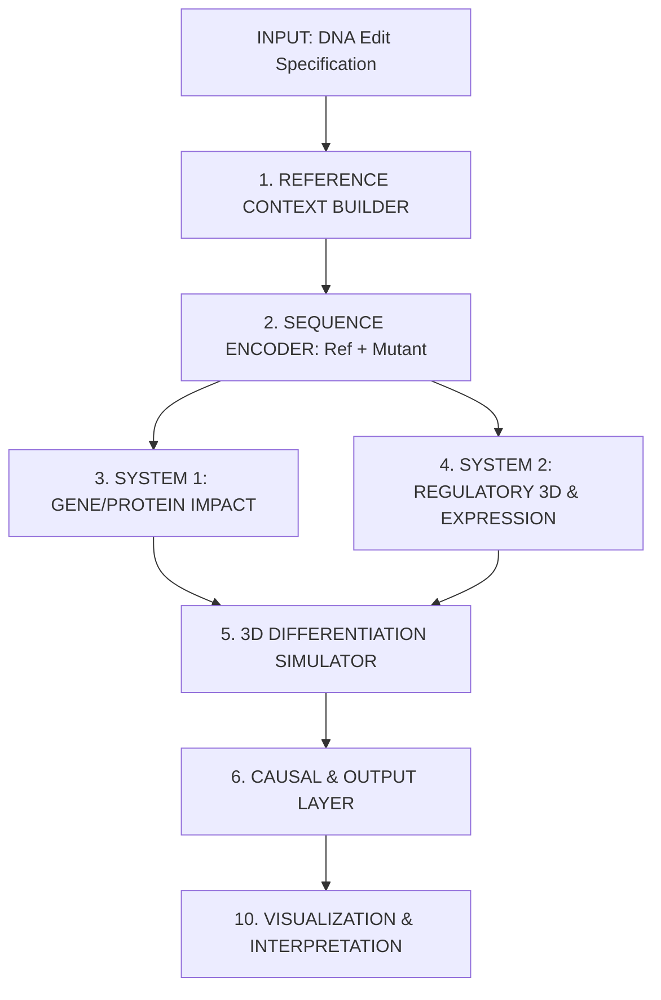

# HG-DT System Specification (v1.1)

This specification outlines the architecture, data flow, and research plan for the **Human Genome Digital Twin (HG-DT) Prototype v0.1**, as designed for the Kwan Lab 3D Genome Research Program.

## 1. Project Objectives

-   **Model Interventions:** Predict effects of SNPs, indels, and large deletions (e.g., enhancer deletions) on multi-scale biology.
-   **Link 3D Structure to Function:** Use predicted contact maps and accessibility tracks to explain gene expression changes.
-   **Predict Protein-Level Impacts:** Translate predicted mRNA isoforms into 3D protein structures with confidence metrics (pLDDT).
-   **Quantify Uncertainty:** Provide calibrated uncertainty and mechanistic attribution for all predictions.

## 2. Integrated Analytical Systems

The platform combines two core systems into a unified modular pipeline:

### System 1: Gene/Regulator Mapping & Protein Impact
-   **Mapping:** Identify affected gene/transcript boundaries and regulatory elements (cCREs).
-   **DNA → RNA:** Predict transcript variants (alternative splicing) following DNA modification.
-   **RNA → Protein:** Translate new isoforms into amino acid sequences and predict structural deltas (AlphaFold 3).

### System 2: Regulatory 3D & Expression Prediction
-   **Regulatory Scanning:** Predict chromatin accessibility (ATAC/DNase) and contact maps (Hi-C) from mutant DNA.
-   **Loop Forecasting:** Forecast loop strength changes (e.g., enhancer–promoter contacts) and their impact on gene expression.

## 3. High-Level Architecture

### Module Breakdown

1.  **Reference Context Builder:** Aggregates GRCh38/hg38 sequences, GENCODE annotations, and ENCODE Screen registry cCREs.
2.  **Sequence Encoder:** Uses AlphaGenome (1 Mb window) and Evo 2 (1M token context) for multi-resolution understanding.
3.  **Protein Module:** Translates mRNA into protein sequences; predicts structure (AlphaFold 3 / BioNeMo ESMFold).
4.  **Causal layer:** Separates correlation from intervention; estimates counterfactual effects and uncertainty.
5.  **3D Simulator (Trajectory):** Interpolates contact maps across differentiation stages (Stem → Progenitor → Differentiated).

## 4. Technical Stack

-   **Platform:** NVIDIA BioNeMo (accelerated training/inference for Evo 2 and AlphaFold).
-   **Genomics Models:** AlphaGenome API (DeepMind), Evo 2 (Arc Institute), Borzoi.
-   **Bioinformatics:** `pyGenomeTracks`, `cooler + cooltools`, `pyranges`, `Biopython`.
-   **Dashboard:** Streamlit (interactive UI), Plotly, NGLview.

## 5. Research Plan & Milestones

| Milestone | Deliverable | Timeline |
| :--- | :--- | :--- |
| **A** | Regulatory Variant Predictor (AlphaGenome integration for track deltas) | Weeks 1-4 |
| **B** | Perturbation-Response Module (Predict expression shifts from CRISPR-like edits) | Weeks 5-6 |
| **C** | Transcript/Isoform Integration (Link DNA deletions to altered mRNA/Protein) | Weeks 7-8 |
| **D** | 3D Differentiation Simulator (Contact map trajectories) | Weeks 9-10 |
| **E** | Full Visualization UI (Streamlit MVP with publication-quality exports) | Weeks 11-12 |

## 6. Evaluation & Benchmarking

-   **Held-out Loci:** Evaluate on genomic regions never seen during model training.
-   **Known Variants:** Validate against ClinVar, eQTL catalogs, and published CRISPRi screens (K562/GM12878).
-   **OOD Stress:** Test on multi-hit edits and long-range regulation outside the input window.
-   **Comparison:** Benchmark against linear models and older sequence-to-function tools (Enformer, Orca).

---
*Reference: Derived from research-grade design discussions, 2026.*
